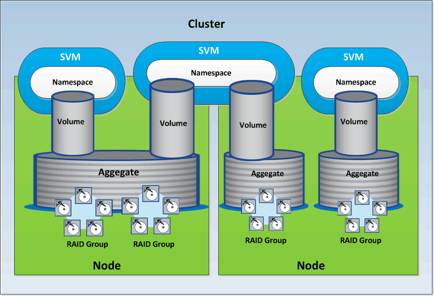

= Recursos de storage no ONTAP
:allow-uri-read: 
:icons: font
:imagesdir: ../media/

[role="lead"]
Os recursos de armazenamento no ONTAP podem ser classificados amplamente em _recursos de armazenamento físico_ e _recursos de armazenamento lógico_. Para gerenciar com eficiência seus sistemas ONTAP usando as APIs fornecidas no Active IQ Unified Manager, você precisa entender o modelo de recursos de storage e a relação entre vários recursos de storage.

* *Recursos de armazenamento físico*

Refere-se aos objetos de armazenamento físico fornecidos pelo ONTAP. Os recursos físicos de storage incluem discos, clusters, controladores de storage, nós e agregados.

* *Recursos lógicos de armazenamento*

Refere-se aos recursos de storage fornecidos pelo ONTAP que não estão vinculados a um recurso físico. Esses recursos são associados a uma máquina virtual de storage (SVM, anteriormente conhecida como SVM) e existem independentemente de qualquer recurso de storage físico específico, como disco, LUN de array ou agregado.

Os recursos de storage lógicos incluem volumes de todos os tipos e qtrees, além dos recursos e configurações que você pode usar com esses recursos, como cópias Snapshot, deduplicação, compactação e cotas.

A ilustração a seguir mostra os recursos de armazenamento em um cluster de 2 nós:

